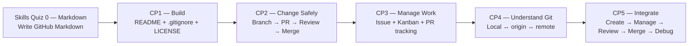

# GitHub Foundations

A navigation hub for the KLIS-CS GitHub Foundations skills quiz and checkpoint sequence.

## Developer Achievement Dashboard

[**Open the Developer Achievement Dashboard →**](https://klis-cs.github.io/GitHub-Foundations/)

Trusted CP1–CP5 grader evidence is converted into skill XP and badges. The public profile shows verified achievements and progress, **not academic grades**.

```text
checkpoint evidence → verified completion → XP → badges → Developer Profile
```

## Learning Path Navigation

| Stage | Main Skill | Exercise Repository |
|---|---|---|
| **Skills Quiz 0** | Markdown Foundations | [GitHub-Markdown-Skills-Quiz](https://github.com/KLIS-CS/GitHub-Markdown-Skills-Quiz) |
| **CP1** | Repository Setup | [GitHub-Repository-Setup](https://github.com/KLIS-CS/GitHub-Repository-Setup) |
| **CP2** | Feature Branch → PR → Review → Merge | [GitHub-Feature-Branch-Pull-Request-Workflow](https://github.com/KLIS-CS/GitHub-Feature-Branch-Pull-Request-Workflow) |
| **CP3** | Issues + Kanban Project Management | [GitHub-Issues-Projects-Workflow](https://github.com/KLIS-CS/GitHub-Issues-Projects-Workflow) |
| **CP4** | Local ↔ Remote Mental Model | [KLIS-CS-Git-Local-Remote-Workflow](https://github.com/KLIS-CS/KLIS-CS-Git-Local-Remote-Workflow) |
| **CP5** | Final Integrated Workflow from Scratch | [GitHub-Final-Integrated-Challenge](https://github.com/KLIS-CS/GitHub-Final-Integrated-Challenge) |

## Learning Progression



The checkpoints deliberately add one major layer at a time.

| Stage | Main question being tested |
|---|---|
| **Skills Quiz 0 — Markdown** | Can you write the Markdown syntax used throughout GitHub without a walkthrough? |
| **CP1 — Repository Setup** | Can you complete a clean repository with a useful README, meaningful .gitignore, and real LICENSE? |
| **CP2 — Branch & PR Workflow** | Can you implement work on a feature branch, open a PR, receive review, and merge only after approval? |
| **CP3 — Issues & Projects** | Can you represent work as an Issue and track both the Issue and PR through a Kanban workflow? |
| **CP4 — Local ↔ Remote** | Do you understand local state, `origin`, remote-tracking state, `clone`, `push`, `fetch`, and `pull`? |
| **CP5 — Final Integrated Challenge** | Can you independently create a repository from scratch and combine setup, Issue/Project management, Git, PR review/merge, and debugging? |

## Recommended Order

**Skills Quiz 0 → CP1 → CP2 → CP3 → CP4 → CP5**

The sequence is:

```text
Write
→ Build
→ Change Safely
→ Manage Work
→ Understand the System
→ Integrate Independently
```

## Shared Grading Architecture

### CP1–CP4

CP1–CP4 use the same student/teacher pattern:

```text
student repository
→ automatic evidence /60
→ original Exercise Issue score comment updates in place
→ Submit CP to KLIS-CS mother repository
→ teacher enters /manual-grade /40
→ teacher grade syncs back to the same Exercise Issue
→ Final /100
```

Students do **not** manually run Actions. Repository events trigger grading automatically.

For this no-secret synchronization design, CP1–CP4 student repositories must remain **Public**.

### CP5

CP5 is intentionally different because creating the repository from scratch is part of the assessment.

```text
student creates a new repository from scratch
→ completes the full integrated workflow
→ Submit CP5 to the mother repository
→ mother repository automatic /60
→ teacher /manual-grade /40
→ same CP5 Submission Issue shows Final /100
```

The CP5 mother-repository Submission Issue is the grading source of truth.

---

## Student Start Flow

### Skills Quiz 0 — Markdown Foundations

[](https://github.com/new?template_owner=KLIS-CS&template_name=GitHub-Markdown-Skills-Quiz&owner=%40me&name=markdown-skills-quiz&description=Skills+Quiz+0:+Markdown+Foundations&visibility=private)

```text
Copy Exercise
→ edit markdown-quiz.md
→ commit directly to main
→ automatic grader runs
→ open Markdown Skills Quiz — Progress Issue
→ fix and recommit until complete
```

No feature branch, Pull Request, or manual Actions run is required.

### CP1 — Repository Setup

[](https://github.com/new?template_owner=KLIS-CS&template_name=GitHub-Repository-Setup&owner=%40me&name=cp1-repository-setup-YOUR-GITHUB-USERNAME&description=Checkpoint+1:+GitHub+Repository+Setup&visibility=public)

CP1 intentionally stays on `main`.

```text
Copy Exercise
→ work on main
→ create/complete README.md
→ create meaningful .gitignore
→ add real open-source LICENSE
→ automatic /60 in original Exercise Issue
→ Submit CP1
→ teacher /40
→ Final /100 syncs back
```

CP1 does **not** use a feature branch or Pull Request. That separation is intentional: CP1 isolates repository-setup decisions before CP2 introduces branch collaboration.

### CP2 — Feature Branch, Pull Request, Review & Merge

[](https://github.com/new?template_owner=KLIS-CS&template_name=GitHub-Feature-Branch-Pull-Request-Workflow&owner=%40me&name=cp2-feature-branch-pr-workflow&description=Checkpoint+2:+Feature+Branch+%26+Pull+Request+Workflow&visibility=public)

```text
Copy Exercise
→ clone locally
→ create cp2-USERNAME
→ edit feature.txt + submission.md
→ status → add → commit → push
→ open PR to main
→ request review
→ receive human APPROVED review
→ merge
→ automatic /60
→ Submit CP2
→ teacher /40
→ Final /100 syncs back
```

The grader checks that approval happened **before** merge. The feature branch may be deleted after merge because PR history remains durable evidence.

### CP3 — Issues & Project Management

[](https://github.com/new?template_owner=KLIS-CS&template_name=GitHub-Issues-Projects-Workflow&owner=%40me&name=cp3-issues-projects-workflow&description=Checkpoint+3:+Issues+%26+Project+Management&visibility=public)

```text
Copy Exercise
→ create Project Board
→ Todo / In Progress / Review / Done
→ create [CP3] Issue
→ Goal + ≥2 acceptance criteria + label + self-assignee
→ add Issue to Project
→ create cp3-USERNAME branch
→ complete submission.md
→ open PR
→ add PR to the same Project
→ Issue + PR → Review
→ receive human APPROVED review
→ merge
→ Issue + PR → Done
→ close Issue after merge
→ Submit CP3
```

The grader checks GitHub review/merge evidence automatically. Project-board quality and workflow history remain teacher-reviewed.

### CP4 — Local ↔ Remote Mental Model

[](https://github.com/new?template_owner=KLIS-CS&template_name=KLIS-CS-Git-Local-Remote-Workflow&owner=%40me&name=cp4-local-remote-workflow&description=Checkpoint+4:+Local+and+Remote+Git+Workflow&visibility=public)

```text
Copy Exercise
→ clone locally
→ inspect git status
→ inspect git branch -vv
→ inspect git remote -v
→ create cp4-USERNAME
→ explain clone / init / origin / push / fetch / pull
→ commit → push → PR
→ receive human APPROVED review
→ merge
→ Submit CP4
```

CP4 tests whether students understand repository state and data flow rather than merely memorizing commands. In particular, students must distinguish **fetch** from **pull**.

### CP5 — Final Integrated Challenge

CP5 is intentionally **not** a template-copy task.

```text
Open CP5 instructions
→ GitHub: New repository
→ create cp5-final-integrated-USERNAME
→ configure README + .gitignore + LICENSE
→ clone locally
→ create Project: Todo / In Progress / Review / Done
→ create [CP5] Issue and add it to Project
→ Issue: Todo → In Progress
→ create cp5-USERNAME branch
→ implement src/index.js + improve README
→ status → add → commit → push
→ open PR to main with Closes #Issue
→ add PR to same Project
→ Issue + PR → Review
→ receive human APPROVED review
→ merge
→ Issue closes
→ Issue + PR → Done
→ complete debugging/recovery responses
→ Submit CP5
→ mother automatic /60
→ mother /manual-grade /40
→ Final /100
```

CP5 requires students to integrate the previous checkpoints without copying an exercise repository.

## Grading Model

**Skills Quiz 0** is **100% automatically graded**.

**CP1–CP5** use:

```text
60 points — automatic evidence
40 points — teacher review
100 points — final score
```

## Teacher Setup Summary

- **Skills Quiz 0:** Markdown-only template exercise; direct edit/commit; automatic score.
- **CP1:** Public template; repository setup on `main`; no PR.
- **CP2:** Public template; feature branch → PR → human approval → merge.
- **CP3:** Public template; Issue + four-status Kanban Project + PR tracking → review → merge → Done.
- **CP4:** Public template; local/remote mental model + full reviewed PR lifecycle.
- **CP5:** Student-created public repository from scratch; full integrated workflow; mother repository is the submission/grading portal.
