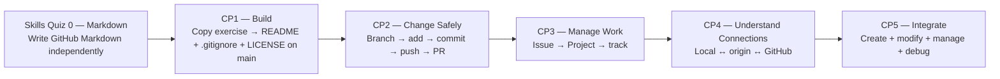

# GitHub Foundations

A navigation hub for the KLIS-CS GitHub Foundations skills quiz and checkpoint sequence.

## Developer Achievement Dashboard

[**Open the Developer Achievement Dashboard →**](https://klis-cs.github.io/GitHub-Foundations/)

Trusted CP1–CP5 grader evidence is converted into skill XP and badges. The public profile shows verified achievements and progress, **not academic grades**.

```text
checkpoint evidence → verified completion → XP → badges → Developer Profile
```

## Learning Path Navigation

| Stage | Skill | Exercise Repository |
|---|---|---|
| **Skills Quiz 0** | Markdown Foundations | [GitHub-Markdown-Skills-Quiz](https://github.com/KLIS-CS/GitHub-Markdown-Skills-Quiz) |
| **CP1** | Repository Setup — Copy Exercise + Main Only | [GitHub-Repository-Setup](https://github.com/KLIS-CS/GitHub-Repository-Setup) |
| **CP2** | Feature Branch & Pull Request Workflow | [GitHub-Feature-Branch-Pull-Request-Workflow](https://github.com/KLIS-CS/GitHub-Feature-Branch-Pull-Request-Workflow) |
| **CP3** | Issues & Project Management | [GitHub-Issues-Projects-Workflow](https://github.com/KLIS-CS/GitHub-Issues-Projects-Workflow) |
| **CP4** | Local ↔ Remote Mental Model | [KLIS-CS-Git-Local-Remote-Workflow](https://github.com/KLIS-CS/KLIS-CS-Git-Local-Remote-Workflow) |
| **CP5** | Final Integrated Challenge — Create + Modify + Manage + Debug | [GitHub-Final-Integrated-Challenge](https://github.com/KLIS-CS/GitHub-Final-Integrated-Challenge) |

## Learning progression



The central design rule is that students must **do real Git/GitHub work**, not only answer terminology questions.

| Stage | Main question being tested |
|---|---|
| **Skills Quiz 0** | Can you write the Markdown syntax used throughout GitHub without a walkthrough? |
| **CP1 — Repository Setup** | Can you use the official exercise copy and correctly complete `README.md`, `.gitignore`, and `LICENSE` on `main`? |
| **CP2 — Feature Branch & Pull Request** | Can you modify an existing project safely through a feature branch and Pull Request instead of editing `main` directly? |
| **CP3 — Issues & Projects** | Can you create, organize, and track a unit of development work? |
| **CP4 — Local ↔ Remote** | Do you understand and use the connection between a local repository and GitHub, including `origin`, `clone`, `push`, `pull`, and local-first vs GitHub-first setup? |
| **CP5 — Final Integrated Challenge** | Can you create a fresh repository and independently combine setup, local modification, Issue/Project tracking, feature branches, commits, pushes, Pull Requests, and debugging? |

## Recommended Order

**Skills Quiz 0 → CP1 → CP2 → CP3 → CP4 → CP5**

The sequence moves through:

**Write → Build → Modify Safely → Manage → Understand → Integrate**

## Shared grading architecture

CP1–CP4 use the same student/teacher pattern:

```text
student repository
→ automatic evidence /60
→ student's own CP — Score Issue
→ Submit CP to KLIS-CS mother repository
→ teacher enters /manual-grade /40 in mother repository
→ teacher grade is published
→ student's own CP — Score Issue syncs
→ Final score /100
```

For this no-secret synchronization design, the student copies for **CP1–CP4 must remain Public**.

CP5 is intentionally different because creating the repository from scratch is part of the assessment. Its automatic and teacher grading live in the CP5 mother repository; an optional reusable score workflow can mirror the published final score back into the student's own CP5 repository.

## Student Start Flow

### Skills Quiz 0 — Markdown Foundations

```text
Open Skills Quiz 0
→ Copy Exercise
→ Actions
→ Start Markdown Skills Quiz
→ Complete markdown-quiz.md
→ Commit
→ Automatic score /100
```

### CP1 — Repository Setup

[](https://github.com/new?template_owner=KLIS-CS&template_name=GitHub-Repository-Setup&owner=%40me&name=cp1-repository-setup-YOUR-GITHUB-USERNAME&description=Checkpoint+1:+GitHub+Repository+Setup&visibility=public)

CP1 does **not** use a feature branch or Pull Request.

```text
Copy Exercise
→ stay on main
→ create README.md + .gitignore + LICENSE
→ CP1 — Score shows Automatic /60
→ Submit CP1
→ teacher reviews the three files in the mother repository
→ /manual-grade /40
→ student's CP1 — Score updates
→ Final /100
```

All CP1 system files live under `.github/`; the assessed root stays visually clean.

### CP2 — Feature Branch & Pull Request

[](https://github.com/new?template_owner=KLIS-CS&template_name=GitHub-Feature-Branch-Pull-Request-Workflow&owner=%40me&name=cp2-feature-branch-pr-workflow&description=Checkpoint+2:+Feature+Branch+%26+Pull+Request+Workflow&visibility=public)

```text
Copy Exercise
→ clone locally
→ create cp2-USERNAME branch
→ edit feature.txt + submission.md
→ status → add → commit → push
→ open PR to main
→ automatic /60
→ CP2 — Score
→ Submit CP2
→ mother /manual-grade /40
→ Final /100 syncs to student repo
```

### CP3 — Issues & Projects

[](https://github.com/new?template_owner=KLIS-CS&template_name=GitHub-Issues-Projects-Workflow&owner=%40me&name=cp3-issues-projects-workflow&description=Checkpoint+3:+Issues+%26+Project+Management&visibility=public)

```text
Copy Exercise
→ create cp3-USERNAME branch
→ create [CP3] Issue
→ Goal + checklist + label + self-assignee
→ add Project evidence
→ complete submission.md
→ open PR to main
→ automatic /60
→ CP3 — Score
→ Submit CP3
→ mother /manual-grade /40
→ Final /100 syncs to student repo
```

GitHub Project quality remains teacher-reviewed.

### CP4 — Local ↔ Remote

[](https://github.com/new?template_owner=KLIS-CS&template_name=KLIS-CS-Git-Local-Remote-Workflow&owner=%40me&name=cp4-local-remote-workflow&description=Checkpoint+4:+Local+and+Remote+Git+Workflow&visibility=public)

```text
Copy Exercise
→ clone locally
→ inspect status / branch / remote
→ create cp4-USERNAME branch
→ complete command + concept evidence
→ commit → push → PR
→ automatic /60
→ CP4 — Score
→ Submit CP4
→ mother /manual-grade /40
→ Final /100 syncs to student repo
```

### CP5 — Create + Modify + Integrate from Scratch

CP5 is intentionally **not** a template-copy task.

```text
Open CP5 instructions
→ GitHub: New repository
→ create cp5-final-integrated-USERNAME
→ configure README + .gitignore + LICENSE
→ clone locally
→ create [CP5] Issue + Project tracking
→ create cp5-USERNAME branch
→ implement src/index.js
→ status → add → commit → push
→ open PR to main
→ connect PR to Issue
→ complete debugging responses
→ Submit CP5
→ mother automatic /60
→ mother /manual-grade /40
→ CP5 Published Grade shows Final /100
```

Students who want a score Issue in their own from-scratch CP5 repo can add the small reusable score-workflow caller documented in the CP5 instructions. That system file is not graded project content.

## Grading Model

**Skills Quiz 0** is **100% automatically graded**.

**CP1–CP5** use:

```text
60 points — automatic evidence
40 points — teacher review
100 points — final score
```

## Teacher Setup

- **Skills Quiz 0:** template exercise.
- **CP1:** Public Template repository; main-only student work; mother-repository teacher grading.
- **CP2:** Public Template repository; branch + PR execution; mother-repository teacher grading; score sync back to student.
- **CP3:** Public Template repository; Issue / Project management; mother-repository teacher grading; score sync back to student.
- **CP4:** Public Template repository; local ↔ remote commands and mental model; mother-repository teacher grading; score sync back to student.
- **CP5:** from-scratch public repository; mother repository is the submission/grading portal; published final grade can optionally sync back with the reusable workflow.
