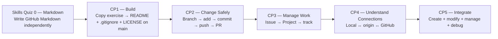

# GitHub Foundations

A navigation hub for the KLIS-CS GitHub Foundations skills quiz and checkpoint sequence.

## Learning Path Navigation

| Stage | Skill | Exercise Repository |
|---|---|---|
| **Skills Quiz 0** | Markdown Foundations | [GitHub-Markdown-Skills-Quiz](https://github.com/KLIS-CS/GitHub-Markdown-Skills-Quiz) |
| **CP1** | Repository Setup — Copy Exercise + Main Only | [GitHub-Repository-Setup](https://github.com/KLIS-CS/GitHub-Repository-Setup) |
| **CP2** | Feature Branch & Pull Request Workflow | [GitHub-Feature-Branch-Pull-Request-Workflow](https://github.com/KLIS-CS/GitHub-Feature-Branch-Pull-Request-Workflow) |
| **CP3** | Issues & Project Management | [GitHub-Issues-Projects-Workflow](https://github.com/KLIS-CS/GitHub-Issues-Projects-Workflow) |
| **CP4** | Local ↔ Remote Mental Model | [KLIS-CS-Git-Local-Remote-Workflow](https://github.com/KLIS-CS/KLIS-CS-Git-Local-Remote-Workflow) |
| **CP5** | Final Integrated Challenge — Create + Modify + Manage + Debug | [GitHub-Final-Integrated-Challenge](https://github.com/KLIS-CS/GitHub-Final-Integrated-Challenge) |

## Learning progression



The central design rule is that students must **do real Git/GitHub work**, not only answer terminology questions.

| Stage | Main question being tested |
|---|---|
| **Skills Quiz 0** | Can you write the Markdown syntax used throughout GitHub without a walkthrough? |
| **CP1 — Repository Setup** | Can you use the official exercise copy and correctly complete `README.md`, `.gitignore`, and `LICENSE` on `main`? |
| **CP2 — Feature Branch & Pull Request** | Can you modify an existing project safely through a feature branch and Pull Request instead of editing `main` directly? |
| **CP3 — Issues & Projects** | Can you create, organize, and track a unit of development work? |
| **CP4 — Local ↔ Remote** | Do you understand and use the connection between a local repository and GitHub, including `origin`, `clone`, `push`, `pull`, and local-first vs GitHub-first setup? |
| **CP5 — Final Integrated Challenge** | Can you create a fresh repository and independently combine setup, local modification, Issue/Project tracking, feature branches, commits, pushes, Pull Requests, and debugging? |

## Recommended Order

**Skills Quiz 0 → CP1 → CP2 → CP3 → CP4 → CP5**

The sequence moves through these layers:

**Write → Build → Modify Safely → Manage → Understand → Integrate**

## Student Start Flow

### Skills Quiz 0 — Markdown Foundations

```text
Open Skills Quiz 0
→ Copy Exercise
→ Actions
→ Start Markdown Skills Quiz
→ Complete markdown-quiz.md
→ Commit
→ Automatic score /100
```

### CP1 — Copy Exercise, then work on `main`

CP1 uses one mother/template repository: `KLIS-CS/GitHub-Repository-Setup`.

[](https://github.com/new?template_owner=KLIS-CS&template_name=GitHub-Repository-Setup&owner=%40me&name=cp1-repository-setup-YOUR-GITHUB-USERNAME&description=Checkpoint+1:+GitHub+Repository+Setup&visibility=public)

CP1 does **not** use a feature branch or Pull Request.

```text
Copy Exercise
→ create cp1-repository-setup-USERNAME in your own account
→ stay on main
→ create README.md
→ create .gitignore
→ create LICENSE
→ save / push finished files to main
→ student's own CP1 — Score Issue shows Automatic /60
→ Submit CP1 to the mother repository
→ teacher reviews all three files in the mother repository
→ teacher enters /manual-grade in the mother repository
→ Teacher /40 + Final /100 sync back to student's own CP1 — Score Issue
```

All CP1 system files, workflows, scripts, and instructions live under `.github/`. The student's assessed root files remain visually separate:

```text
README.md
.gitignore
LICENSE
```

### CP2 — Modify an Existing Repository Safely

```text
Open CP2
→ Copy Exercise
→ clone locally
→ create feature branch
→ modify required files
→ git status
→ git add
→ git commit
→ git push
→ Pull Request
→ automatic grading
→ teacher grading
```

### CP3 — Manage Work

Students create and manage real Issue / Project evidence rather than only answering questions about GitHub project management.

### CP4 — Local ↔ Remote

Students execute and explain the local/remote workflow, including the two repository-starting routes and diagnostic commands.

### CP5 — Create + Modify + Integrate from Scratch

CP5 is intentionally **not** a template-copy task.

```text
Open CP5 instructions
→ GitHub: New repository
→ create cp5-final-integrated-USERNAME
→ configure README + .gitignore + LICENSE
→ clone locally
→ create [CP5] Issue + Project tracking
→ create cp5-USERNAME feature branch
→ modify README + create src/index.js
→ git status → add → commit → push
→ open PR to main
→ connect PR to Issue with Closes/Fixes/Resolves #N
→ complete debugging responses
→ submit external repository URL to CP5
→ automatic grading
→ teacher grading
```

## Grading Model

**Skills Quiz 0** is **100% automatically graded**.

**CP1–CP5** use the shared checkpoint model:

```text
60 points — automatic evidence
40 points — teacher review
100 points — final score
```

For CP1, the student sees the automatic score in their own repository. The teacher uses one central Submission Issue in `KLIS-CS/GitHub-Repository-Setup`, where the three required files are previewed and `/manual-grade` is entered. The published teacher score then synchronizes back to the student's own Score Issue.

## Teacher Setup

- **Skills Quiz 0:** template exercise.
- **CP1:** keep `GitHub-Repository-Setup` **Public** and enable **Template repository**. Students use **Copy Exercise**, work directly on `main`, and see scores in their own repo. Teacher grading happens centrally in the mother repo.
- **CP2:** template exercise for safe modification through branch + PR.
- **CP3:** interactive Issue / Project checkpoint.
- **CP4:** interactive local ↔ remote checkpoint.
- **CP5:** instruction + grading portal for the integrated workflow.
