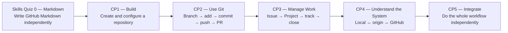

# GitHub Foundations

A navigation hub for the KLIS-CS GitHub Foundations skills quiz and checkpoint sequence.

## Learning Path Navigation

| Stage | Skill | Exercise Repository |
|---|---|---|
| **Skills Quiz 0** | Markdown Foundations | [GitHub-Markdown-Skills-Quiz](https://github.com/KLIS-CS/GitHub-Markdown-Skills-Quiz) |
| **CP1** | Repository Setup | [GitHub-Repository-Setup](https://github.com/KLIS-CS/GitHub-Repository-Setup) |
| **CP2** | Feature Branch & Pull Request Workflow | [GitHub-Feature-Branch-Pull-Request-Workflow](https://github.com/KLIS-CS/GitHub-Feature-Branch-Pull-Request-Workflow) |
| **CP3** | Issues & Project Management | [GitHub-Issues-Projects-Workflow](https://github.com/KLIS-CS/GitHub-Issues-Projects-Workflow) |
| **CP4** | Local ↔ Remote Mental Model | [KLIS-CS-Git-Local-Remote-Workflow](https://github.com/KLIS-CS/KLIS-CS-Git-Local-Remote-Workflow) |
| **CP5** | Final Integrated Challenge | [GitHub-Final-Integrated-Challenge](https://github.com/KLIS-CS/GitHub-Final-Integrated-Challenge) |

### What each stage means



| Stage | Main question being tested | Why it matters |
|---|---|---|
| **Skills Quiz 0 — Markdown Foundations** | **Can you write the Markdown syntax used throughout GitHub without a walkthrough?** | Students prove they can format headings, emphasis, lists, links, code, task lists, blockquotes, and tables before those skills are embedded inside later GitHub work. |
| **CP1 — Repository Setup** | **Can you create and configure a repository correctly from scratch?** | Students learn what makes a usable project repository: `README.md`, `.gitignore`, and LICENSE. |
| **CP2 — Feature Branch & Pull Request Workflow** | **Can you perform the core Git development workflow?** | Students prove they can work safely on a feature branch and move changes through `git add` → `git commit` → `git push` → Pull Request instead of editing `main` directly. |
| **CP3 — Issues & Project Management** | **Can you define, organize, and track work before and during development?** | Students learn that GitHub is not only code storage: Issues describe units of work, Projects track status, and development work can be connected back to the task. |
| **CP4 — Local ↔ Remote Mental Model** | **Do you understand how your local repository connects to GitHub?** | Students explain `origin`, `clone`, `push`, `pull`, `git remote -v`, and the difference between local-first and GitHub-first repository setup. |
| **CP5 — Final Integrated Challenge** | **Can you combine CP1–CP4 independently and recover from mistakes?** | Students demonstrate mastery by planning the work, using Git/GitHub correctly, debugging workflow problems, and explaining why each step exists. |

## Recommended Order

**Skills Quiz 0 → CP1 → CP2 → CP3 → CP4 → CP5**

The sequence deliberately moves through six layers of mastery:

**Write Markdown → Build → Use Git → Manage Work → Understand the System → Integrate**

CP2 and CP4 intentionally overlap in commands but test different abilities: **CP2 tests execution**, while **CP4 tests understanding of the local/remote model**.

## Student Start Flow

### Skills Quiz 0 — Markdown Foundations

This is a short prerequisite skills check. It is intentionally isolated from branching and Pull Requests so the score reflects Markdown skill rather than Git workflow skill.

```text
Open Skills Quiz 0
→ Copy Exercise
→ Actions
→ Start Markdown Skills Quiz
→ Complete markdown-quiz.md
→ Commit to main
→ Automatic score /100
```

### CP1

CP1 intentionally starts differently because the skill being tested is **creating a repository from scratch**.

```text
Open CP1
→ Start CP1 / Create Repository
→ Configure README + .gitignore + LICENSE
→ Submit CP1 Issue Form
→ Automatic grading
→ Teacher grading
```

### CP2–CP5

These checkpoints use reusable exercise copies:

```text
Open checkpoint
→ Copy Exercise
→ Actions
→ Start Exercise
→ Clone locally
→ Complete required branch/work
→ Push
→ Open Pull Request
→ Automatic grading
→ Teacher grading
```

The student should leave the required Pull Request open until teacher review is complete.

## Grading Model

**Skills Quiz 0** is a focused syntax check and is **100% automatically graded**.

```text
100 points — automatic Markdown evidence
```

**CP1–CP5** use the shared checkpoint model:

```text
60 points — automatic evidence
40 points — teacher review
100 points — final score
```

The checkpoint teacher grading area automatically provides a fixed rubric template. The teacher copies the template into a new comment, changes the category scores, adds feedback, and the workflow calculates the teacher subtotal and final score.

## Teacher Setup

- **Skills Quiz 0:** enable **Settings → General → Template repository** so the **Copy Exercise** button works.
- **CP1:** does not need to be a Template repository because students create a repository from scratch.
- **CP2–CP5:** enable **Settings → General → Template repository** so the **Copy Exercise** buttons work.
