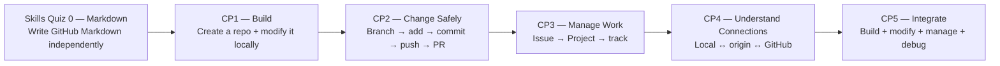

# GitHub Foundations

A navigation hub for the KLIS-CS GitHub Foundations skills quiz and checkpoint sequence.

## Learning Path Navigation

| Stage | Skill | Exercise Repository |
|---|---|---|
| **Skills Quiz 0** | Markdown Foundations | [GitHub-Markdown-Skills-Quiz](https://github.com/KLIS-CS/GitHub-Markdown-Skills-Quiz) |
| **CP1** | Repository Setup — Create + Modify | [GitHub-Repository-Setup](https://github.com/KLIS-CS/GitHub-Repository-Setup) |
| **CP2** | Feature Branch & Pull Request Workflow | [GitHub-Feature-Branch-Pull-Request-Workflow](https://github.com/KLIS-CS/GitHub-Feature-Branch-Pull-Request-Workflow) |
| **CP3** | Issues & Project Management | [GitHub-Issues-Projects-Workflow](https://github.com/KLIS-CS/GitHub-Issues-Projects-Workflow) |
| **CP4** | Local ↔ Remote Mental Model | [KLIS-CS-Git-Local-Remote-Workflow](https://github.com/KLIS-CS/KLIS-CS-Git-Local-Remote-Workflow) |
| **CP5** | Final Integrated Challenge | [GitHub-Final-Integrated-Challenge](https://github.com/KLIS-CS/GitHub-Final-Integrated-Challenge) |

## Learning progression



The central design rule is that students must **do real Git/GitHub work**, not only answer terminology questions. The sequence deliberately includes both **creating** repositories and **modifying** repositories.

| Stage | Main question being tested |
|---|---|
| **Skills Quiz 0** | Can you write the Markdown syntax used throughout GitHub without a walkthrough? |
| **CP1 — Repository Setup** | Can you create a new repository yourself, choose README / `.gitignore` / LICENSE setup, clone it, modify it locally, commit, and push? |
| **CP2 — Feature Branch & Pull Request** | Can you modify an existing project safely through a feature branch and Pull Request instead of editing `main` directly? |
| **CP3 — Issues & Projects** | Can you create, organize, and track a unit of development work? |
| **CP4 — Local ↔ Remote** | Do you understand and use the connection between a local repository and GitHub, including `origin`, `clone`, `push`, `pull`, and local-first vs GitHub-first setup? |
| **CP5 — Final Integrated Challenge** | Can you combine repository setup, modification, work tracking, Git workflow, Pull Requests, and debugging independently? |

## Recommended Order

**Skills Quiz 0 → CP1 → CP2 → CP3 → CP4 → CP5**

The sequence moves through these layers:

**Write → Create → Modify Safely → Manage → Understand → Integrate**

## Student Start Flow

### Skills Quiz 0 — Markdown Foundations

```text
Open Skills Quiz 0
→ Copy Exercise
→ Actions
→ Start Markdown Skills Quiz
→ Complete markdown-quiz.md
→ Commit
→ Automatic score /100
```

### CP1 — Create + Modify from Scratch

CP1 is intentionally **not** a template-copy task.

```text
Open CP1 instructions
→ GitHub: New repository
→ create cp1-repository-setup-USERNAME
→ add README + .gitignore + LICENSE yourself
→ clone your new repository locally
→ git status
→ modify README / .gitignore meaningfully
→ git add
→ git commit
→ git push
→ submit repository URL to CP1
→ automatic grading
→ teacher grading
```

This checks both halves of the skill: **creating the repository** and **changing it through local Git**.

### CP2 — Modify an Existing Repository Safely

```text
Open CP2
→ Copy Exercise
→ clone locally
→ create feature branch
→ modify required files
→ git status
→ git add
→ git commit
→ git push
→ Pull Request
→ automatic grading
→ teacher grading
```

### CP3–CP5

Each later checkpoint requires real GitHub evidence. Students should perform the requested work rather than only describing commands or concepts.

## Grading Model

**Skills Quiz 0** is **100% automatically graded**.

**CP1–CP5** use the shared checkpoint model:

```text
60 points — automatic evidence
40 points — teacher review
100 points — final score
```

CP1 uses a central submission Issue so the grader can inspect the student's **separately created public repository**. CP2–CP5 use the evidence model appropriate to the specific checkpoint.

## Teacher Setup

- **Skills Quiz 0:** template exercise.
- **CP1:** instruction + grading portal. Students create their own repository from scratch; do not direct them to copy CP1 as a template.
- **CP2:** template exercise for safe modification through branch + PR.
- **CP3–CP5:** interactive checkpoint repositories with automatic evidence plus teacher review.
